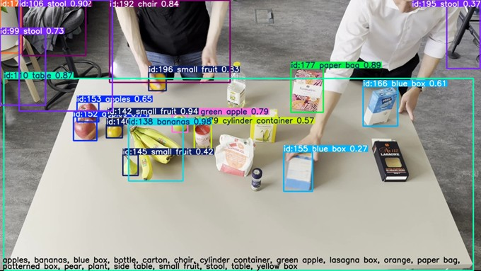
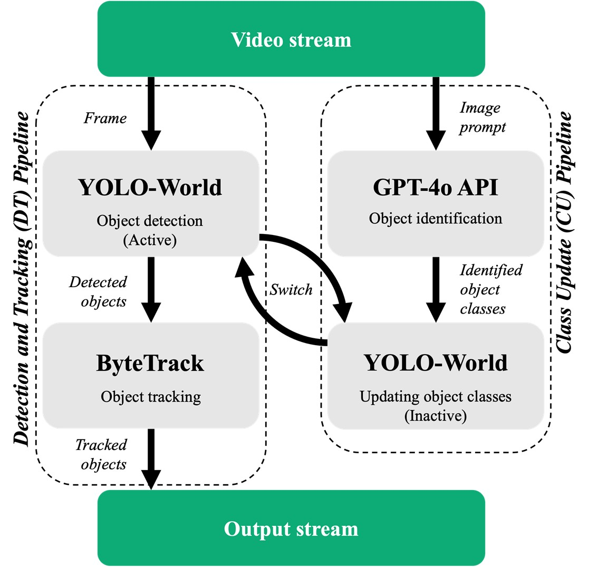

<div align="center">

<h1>DOVRT-DT: Dynamic, Open-Vocabulary, Real-Time Object Detection & Tracking</h1>

<p align="center">
  <a href="https://youtu.be/QGXNCmLZKl4">
    
  </a>
  &nbsp;&nbsp;
  <a href="https://urn.kb.se/resolve?urn=urn%3Anbn%3Ase%3Akth%3Adiva-367616">
    
  </a>
</p>

<p align="center">
  <a href="https://youtu.be/QGXNCmLZKl4">
    
  </a>
</p>

<p align="center">
  <strong>Thesis:</strong>
  <a href="https://urn.kb.se/resolve?urn=urn%3Anbn%3Ase%3Akth%3Adiva-367616">
    <em>Computer Vision in Cooking Support Systems:<br>
    Leveraging Multimodal LLMs for Dynamic, Open-Vocabulary, Real-Time Object Detection and Tracking</em>
  </a>
</p>

</div>


## Overview

DOVRT-DT is a system for **Dynamic, Open-Vocabulary, Real-Time Object Detection & Tracking**, defined as follows:
- **Dynamic:** The set of detectable object classes is not provided beforehand but automatically updated throughout the video stream.
- **Open-Vocabulary:** Can detect any object described in natural language, including unseen ones. A list of target classes may be provided.
- **Real-Time:** Detection and tracking are fast enough to process each frame in a live video feed at 30 frames per second.

### The Gap Addressed by DOVRT-DT
- **Large Multimodal Models (LMMs)** (e.g. GPT-4o) can produce rich semantic descriptions. However, they generally **lack the ability to assign exact coordinates** to individual objects, and their **processing speed** often restricts use in time-sensitive applications (e.g. live video).
- **Object detectors/trackers** (e.g. YOLO-World + ByteTrack) are **specifically designed to assign exact coordinates** and to maintain identities across frames at high frame rates. However, they are typically **constrained by a predefined or provided class list** and therefore remain **static** during a session.

DOVRT-DT bridges this gap through a hybrid approach, by combining an LMM (**GPT-4o**) with open-vocabulary object detection (**YOLO-World**) and tracking (**ByteTrack**). In short, the target vocabulary of YOLO-World is continuously updated at runtime as GPT-4o provides dynamic class inputs at regular intervals.

### Universal Applicability 
Although evaluated on **kitchen video** for the thesis, **DOVRT-DT** is **domain-agnostic**, applicable to dynamic settings with many potential classes and a need for tracking.


## System Architecture

<table>
<tr>
<td width="420" valign="middle">

<a href="figs/figure1.jpg">
  
</a>
<p align="center"><em>Figure 1. Model architecture of DOVRT-DT. Gray blocks represent GPU processes.</em></p>

</td>
<td valign="top">

### Components
- **YOLO-World ×2 (Active / Inactive):** One runs inference, the other updates its detectable class list, then they swap.
- **ByteTrack (single instance):** Maintains stable IDs across frames and detector swaps.
- **GPT-4o API:** Infers a contextual set of classes from periodic frames + `prompt.txt`.

### Why Two Detector Instances?
- Updating YOLO-World’s class list is slower than a single frame pass.
- Performing updates on the **inactive** worker keeps the detect/track path real-time.
- A **single** ByteTrack instance preserves track IDs across detector swaps.

### Frame Rate vs. Update Rate
- **Detection/Tracking** runs at the video rate (bounded by model speed).
- **GPT-4o** runs less frequently, since objects persist across many frames.

<sub>For full details, see the <a href="https://urn.kb.se/resolve?urn=urn%3Anbn%3Ase%3Akth%3Adiva-367616">thesis (Method → System Architecture) 🔗</a> </sub>

</td>
</tr>
</table>


## Repository Structure
~~~text
.
├─ figs/                 # README images
│  ├─ figure1.jpg        # System overview figure
│  └─ thumbnail.jpg      # README header thumbnail
├─ bytetrack.py          # ByteTrack wrapper
├─ gpt.py                # OpenAI client wrapper
├─ yolo.py               # YOLOWorld wrapper
├─ main.py               # Main script. Starts the pipeline and coordinates everything (most logic lives here)
├─ prompt.txt            # LMM prompt
└─ requirements.txt      # Runtime dependencies
~~~


## Quickstart
```bash
# Default output path (output.mp4), live preview ON
python main.py path/to/input.mp4

# Custom output path
python main.py path/to/input.mp4 results/out.mp4

# Disable live preview
python main.py path/to/input.mp4 --no-realtime

# Verbose logging
python main.py path/to/input.mp4 --verbose
```

### OpenAI API Key
```bash
# Windows (PowerShell)
$Env:OPENAI_API_KEY="sk-…"

# macOS/Linux
export OPENAI_API_KEY="sk-…"
```


## Authors
- Arvid Hedbäck
- Gustaf Asada
